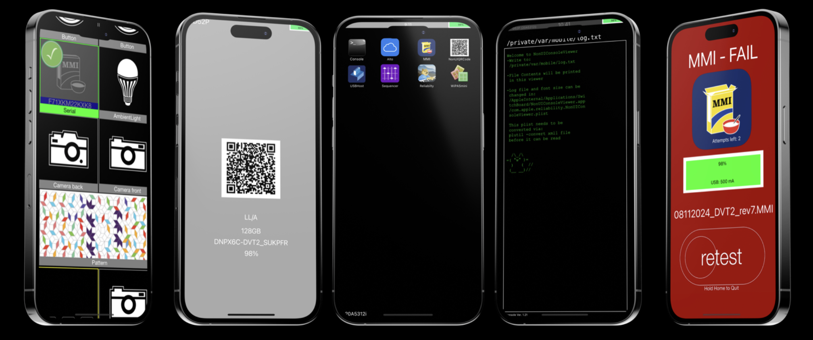

# NonUI Simulator App

NonUI Simulator App is a simple simulator iOS app built with Storyboard, compatible with iOS 14-17. The app provides a straightforward simulation environment for non-UI-based applications.

## ✨ Features

- 🛠️ Simulate non-UI based applications
- 📱 Compatible with iOS 14-17
- 🔧 Easy to extend and modify

## 📥 Installation

You can sideload the NonUI Simulator App using AltStore, TrollStore, or Scarlet.
